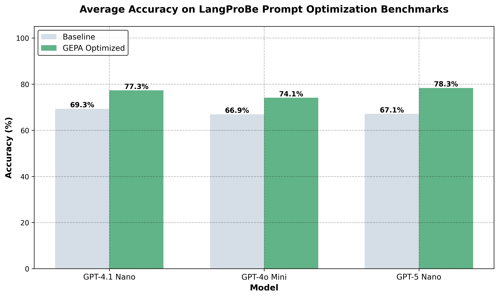

# Synth

[](https://www.python.org/)
[](https://pypi.org/project/synth-ai/)
[](https://pypi.org/project/synth-ai/0.4.7/)
[](https://pypi.org/project/synth-ai/0.4.7/)
[](LICENSE)


Serverless Posttraining APIs for Developers

<p align="center">
  <picture align="center">
    <source media="(prefers-color-scheme: dark)" srcset="assets/langprobe_v2_dark.png">
    <source media="(prefers-color-scheme: light)" srcset="assets/langprobe_v2_light.png">
    
  </picture>
</p>

<p align="center">
  <i>Average accuracy on <a href="https://arxiv.org/abs/2502.20315">LangProBe</a> prompt optimization benchmarks.</i>
</p>

## Demo Notebooks (Colab)

- [GEPA Banking77 Prompt Optimization](https://colab.research.google.com/github/synth-laboratories/synth-ai/blob/main/demos/gepa_banking77/gepa_banking77_prompt_optimization.ipynb)
- [GEPA Crafter VLM Verifier Optimization](https://colab.research.google.com/github/synth-laboratories/synth-ai/blob/main/demos/gepa_crafter_vlm/gepa_crafter_vlm_verifier_optimization.ipynb)
- [GraphGen Image Style Matching](https://colab.research.google.com/github/synth-laboratories/synth-ai/blob/main/demos/image_style_matching/graphgen_image_style_matching.ipynb)

## Highlights

- 🎯 **GEPA Prompt Optimization** - Automatically improve prompts with evolutionary search. See 70%→95% accuracy gains on Banking77, +62% on critical game achievements
- 🔍 **Zero-Shot Verifiers** - Fast, accurate rubric-based evaluation with configurable scoring criteria
- 🧬 **GraphGen** - Train custom verifier graphs optimized for your specific workflows. Train custom pipelines for other tasks
- 🚀 **No Code Changes** - Wrap existing code in a FastAPI app and optimize via HTTP. Works with any language or framework
- ⚡️ **Local Development** - Run experiments locally with tunneled task apps. No cloud setup required
- 🗂️ **Multi-Experiment Management** - Track and compare prompts/models across runs with built-in experiment queues

## Getting Started

```
uv add
uv run synth-ai tui
```

## Testing

Run the TUI integration tests:

```bash
cd synth_ai/_tui
bun test
```

Synth is maintained by devs behind the [MIPROv2](https://scholar.google.com/citations?view_op=view_citation&hl=en&user=jauNVA8AAAAJ&citation_for_view=jauNVA8AAAAJ:u5HHmVD_uO8C) prompt optimizer.

## Documentation

**[docs.usesynth.ai](https://docs.usesynth.ai)**

## GEPA Prompt Optimization (SDK)

Run GEPA prompt optimization programmatically:

```python
import asyncio
import os
from synth_ai.sdk.api.train.prompt_learning import PromptLearningJob
from synth_ai.sdk.localapi import LocalAPIConfig, create_local_api

# Create a local task app: app = create_local_api(LocalAPIConfig(app_id="my_app", handler=my_handler))

# Create and submit a GEPA job
pl_job = PromptLearningJob.from_dict({
    "job_type": "prompt_learning",
    "config": {
        "prompt_learning": {
            "gepa": {
                "rollout": {"budget": 100},
                "population_size": 10,
                "generations": 5,
            }
        }
    },
    "task_app_id": "my_task_app",
})

pl_job.submit()
result = pl_job.stream_until_complete(timeout=3600.0)
print(f"Best score: {result.best_score}")
```

See the [Banking77 demo notebook](demos/gepa_banking77/gepa_banking77_prompt_optimization.ipynb) for a complete example with local task apps.

## Zero-Shot Verifiers (SDK)

Run a built-in verifier graph with rubric criteria passed at runtime. See the [Crafter VLM demo](demos/gepa_crafter_vlm/) for verifier optimization:

```python
import asyncio
import os
from synth_ai.sdk.graphs import VerifierClient

async def run_verifier():
    client = VerifierClient(
        base_url=os.environ["SYNTH_BACKEND_BASE"],
        api_key=os.environ["SYNTH_API_KEY"],
    )
    result = await client.evaluate(
        job_id="zero_shot_verifier_single",
        trace={"session_id": "s", "session_time_steps": []},
        rubric={
            "event": [{"id": "accuracy", "weight": 1.0, "description": "Correctness"}],
            "outcome": [{"id": "task_completion", "weight": 1.0, "description": "Completed task"}],
        },
        options={"event": True, "outcome": True, "model": "gpt-5-nano"},
        policy_name="my_policy",
        task_app_id="my_task",
    )
    return result

asyncio.run(run_verifier())
```

You can also call arbitrary graphs directly:

```python
from synth_ai.sdk.graphs import GraphCompletionsClient

client = GraphCompletionsClient(base_url="https://api.usesynth.ai", api_key="...")
resp = await client.run(
    graph={"kind": "zero_shot", "verifier_shape": "mapreduce", "verifier_mode": "rubric"},
    input_data={"trace": {"session_id": "s", "session_time_steps": []}, "rubric": {"event": [], "outcome": []}},
)
```

## GraphGen: Train Custom Verifier Graphs

Train custom verifier graphs using GraphGen. See the [Image Style Matching demo](demos/image_style_matching/) for a complete GraphGen example:

```python
from synth_ai.sdk.api.train.graphgen import GraphGenJob

# Train a verifier graph
verifier_job = GraphGenJob.from_dataset(
    dataset="verifier_dataset.json",
    graph_type="verifier",
    policy_models=["gpt-4.1"],
    proposer_effort="medium",  # Use "medium" (gpt-4.1) or "high" (gpt-5.2)
    rollout_budget=200,
)
verifier_job.submit()
result = verifier_job.stream_until_complete(timeout=3600.0)

# Run inference with trained verifier
verification = verifier_job.run_verifier(
    trace=my_trace,
    context={"rubric": my_rubric},
)
print(f"Score: {verification.score}, Reasoning: {verification.reasoning}")
```
