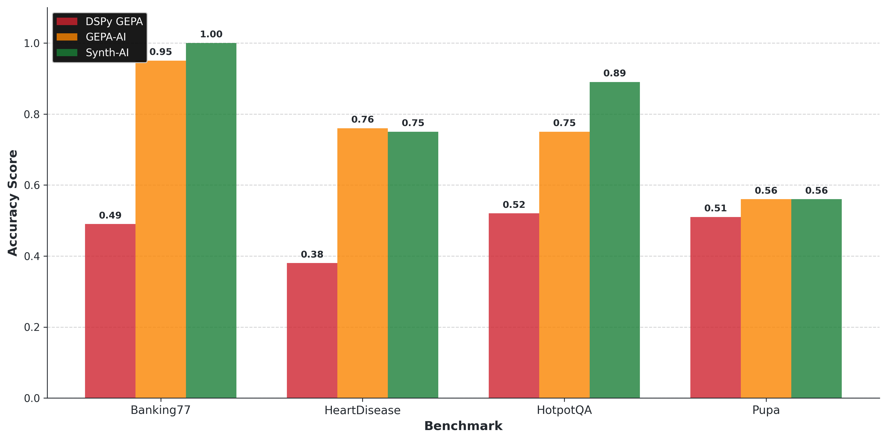

# Synth

[](https://pypi.python.org/pypi/synth-ai)
[](https://pypi.python.org/pypi/synth-ai)
[](https://pypi.python.org/pypi/synth-ai)

Serverless Posttraining APIs for Developers

<p align="center">
  <picture align="center">
    <source media="(prefers-color-scheme: dark)" srcset="benchmark_performance_dark.png">
    <source media="(prefers-color-scheme: light)" srcset="benchmark_performance_light.png">
    
  </picture>
</p>

<p align="center">
  <i>Average accuracy on <a href="https://arxiv.org/abs/2502.20315">LangProBe</a> prompt optimization benchmarks.</i>
</p>

## Highlights

- 🚀 Train across sft, RL, and prompt opt by standing up a single cloudflared Fastapi wrapper around your code. No production code churn.
- ⚡️ Parallelize training and achieve 80% GPU util. via PipelineRL
- 🗂️ Train prompts and models across multiple experiments
- 🛠️ Spin up experiment queues and datastores locally for dev work
- 🔩 Run serverless training via cli or programmatically
- 🏢 Scales gpu-based model training to 64 H100s seemlessly
- 💾 Use GEPA-calibrated judges for fast, accurate rubric scoring
- 🖥️ Supports HTTP-based training across all programming languages
- 🤖 CLI utilities tuned for use with Claude Code, Codex, Opencode

## Getting Started

```bash
# Use with OpenAI Codex
uvx synth-ai codex
```

```bash
# Use with Opencode
uvx synth-ai opencode
```

Synth is maintained by devs behind the [MIPROv2](https://scholar.google.com/citations?view_op=view_citation&hl=en&user=jauNVA8AAAAJ&citation_for_view=jauNVA8AAAAJ:u5HHmVD_uO8C) prompt optimizer.

## Documentation

Docs available at [docs.usesynth.ai](https://docs.usesynth.ai/overview).
