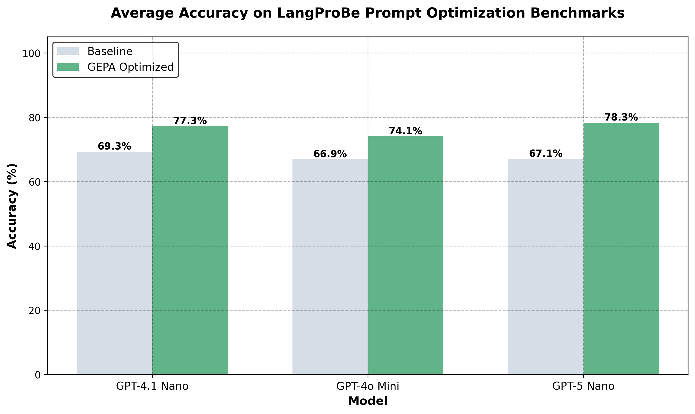

# Synth

[](https://www.python.org/)
[](https://pypi.org/project/synth-ai/)
[](https://crates.io/crates/synth-ai)
[](LICENSE)

Build systems for OOMs more complexity.

Continual and offline optimization for prompts, context, skills, and long-horizon memory.

Use the SDK in Python (`uv add synth-ai`) and Rust (beta) (`cargo add synth-ai`), or call Synth endpoints from any language.

## Synth Style

Synth is built for frontier builders first. We:

- push interface complexity inward (strong server contracts, simpler app surfaces)
- design online/offline parity with pause/resume as first-class controls
- meet production code where it is (no forced lock-in or rewrites)
- build general algorithmic foundations, then layer targeted affordances

For engineering principles and coding standards, see [specs/README.md](specs/README.md).

<p align="center">
  <picture align="center">
    <source media="(prefers-color-scheme: dark)" srcset="assets/langprobe_v2_dark.png">
    <source media="(prefers-color-scheme: light)" srcset="assets/langprobe_v2_light.png">
    
  </picture>
</p>

<p align="center">
  <i>Average accuracy on <a href="https://arxiv.org/abs/2502.20315">LangProBe</a> prompt optimization benchmarks.</i>
</p>

## Demo Walkthroughs

- [GEPA Banking77 Prompt Optimization](https://docs.usesynth.ai/cookbooks/banking77-colab)
- [GEPA Crafter VLM Verifier Optimization](https://docs.usesynth.ai/cookbooks/verifier-optimization)
- [GraphGen Image Style Matching](https://docs.usesynth.ai/cookbooks/graphs/overview)

Benchmark and demo runner source files live in the `Benchmarking` repo (`../Benchmarking` in a sibling checkout).

## Product Focus

- **Continual Learning Sessions (MIPRO + GEPA)**: run online sessions that update prompts from reward feedback during live traffic, with first-class `pause`/`resume`/`cancel` controls.
- **Discrete GEPA Optimization (Prompt + Context)**: run offline GEPA jobs for controlled batch optimization, compare artifacts, and promote the best candidates.
- **Voyager for Skills + Long-Term Memory**: optimize skill/context surfaces and use durable memory with retrieval and summarization for long-horizon agent systems.
- **One Canonical Runtime Surface**: use shared `systems`, `offline`, and `online` primitives across SDK and HTTP APIs.
- **Agent Infrastructure Built In**: run with pools, containers, and tunnels for local or managed rollouts without forcing app rewrites.
- **Graph + Verifier Workflows**: train GraphGen pipelines and rubric-based verifiers for domain-specific evaluation loops.

## Getting Started

### Python SDK

```bash
uv add synth-ai
# or
pip install synth-ai==0.9.4
```

### Rust SDK (beta)

```bash
cargo add synth-ai
```

### API (any language)

Use your `SYNTH_API_KEY` and call Synth HTTP endpoints directly.

Docs: [docs.usesynth.ai](https://docs.usesynth.ai)

## Codex CLI Setup

Install Synth, then register the hosted managed-research MCP server with one command:

```bash
uv tool install synth-ai
synth-ai mcp codex install
```

Codex will start the OAuth flow for the hosted MCP server. After login, call `smr_projects_list`, `smr_project_status_get`, or `smr_project_trigger_run`.

If you need the local stdio fallback instead of the hosted endpoint:

```bash
synth-ai setup
synth-ai mcp codex install --transport stdio
```
